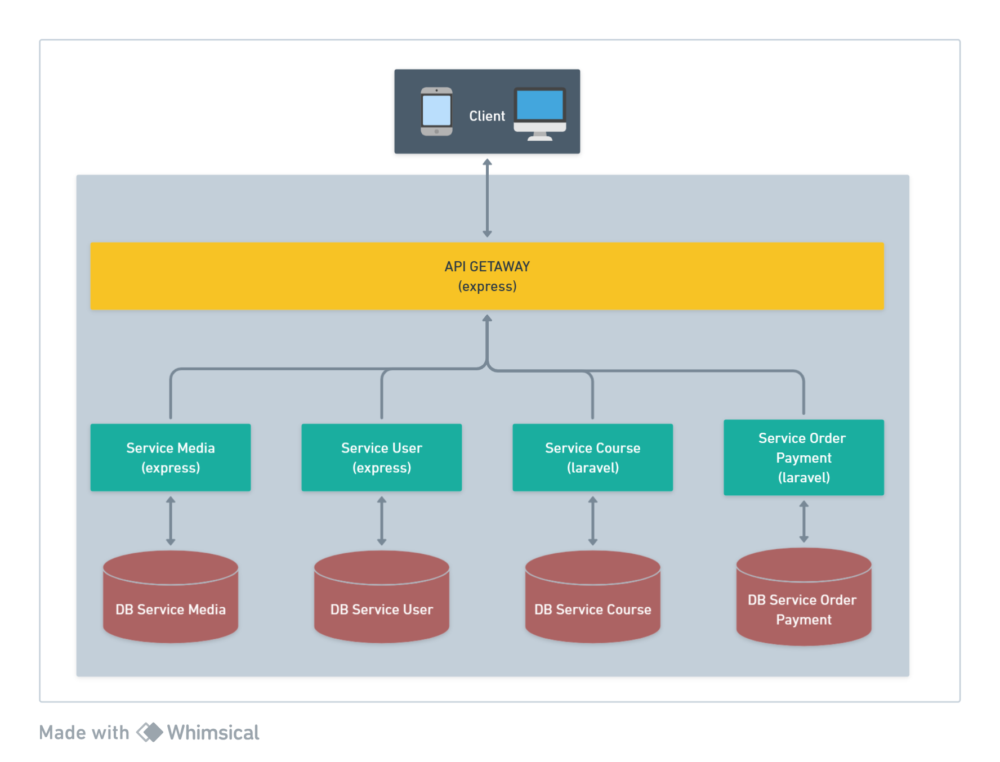
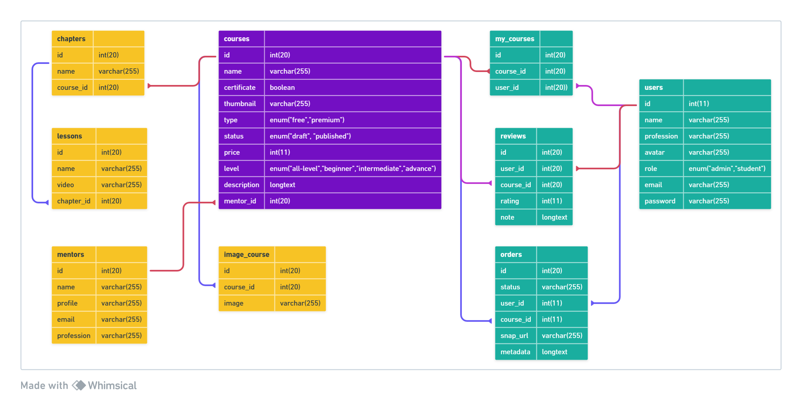

# Eduflex Microservice RESTful API

## Microservice Architecture

## Entity Relationship Diagram

## Stack

| Service               | Framework  |
| --------------------- | ---------- |
| API Getaway           | Express JS |
| Service User          | Express JS |
| Service Media         | Express JS |
| Service Course        | Laravel 10 |
| Service Order Payment | Laravel 10 |

## API Specs

You can find it in the `docs` folder.
